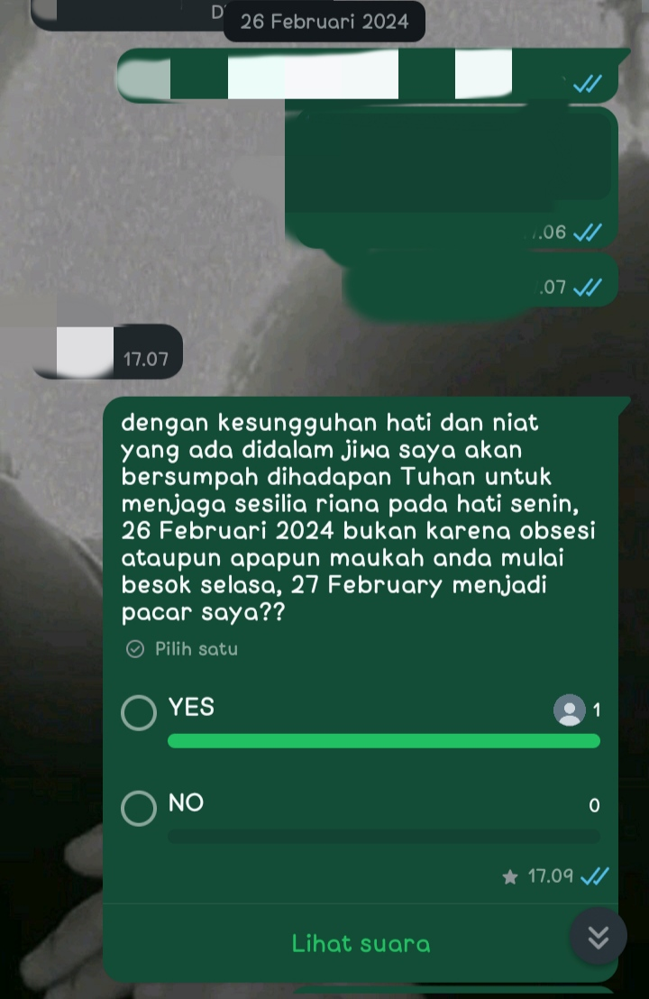
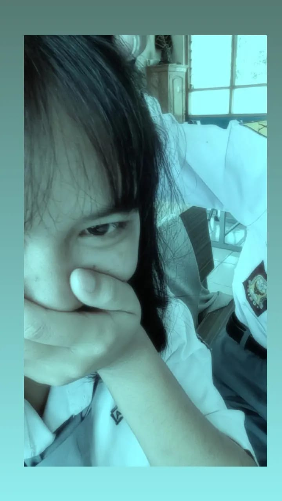
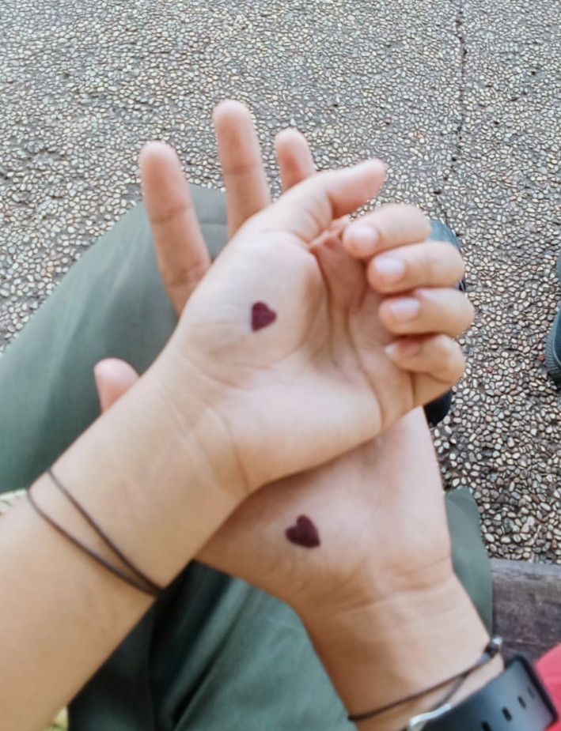
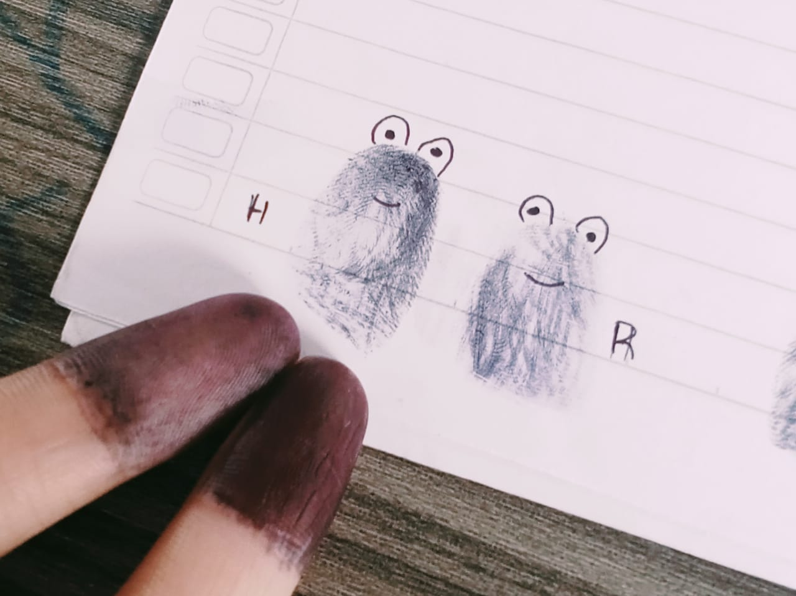
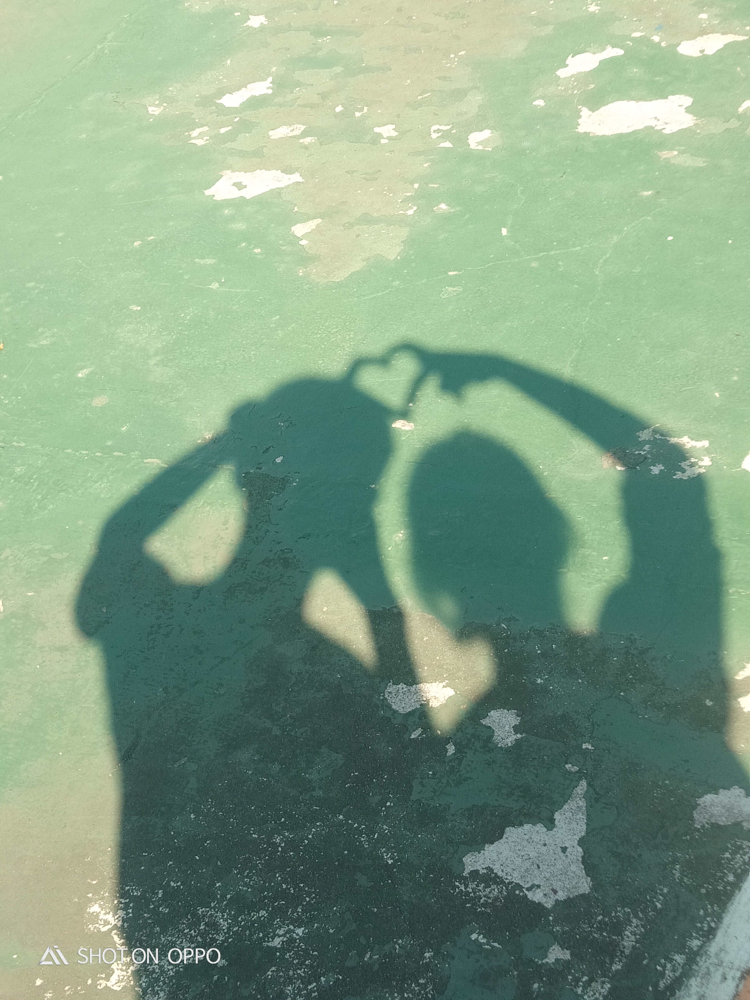
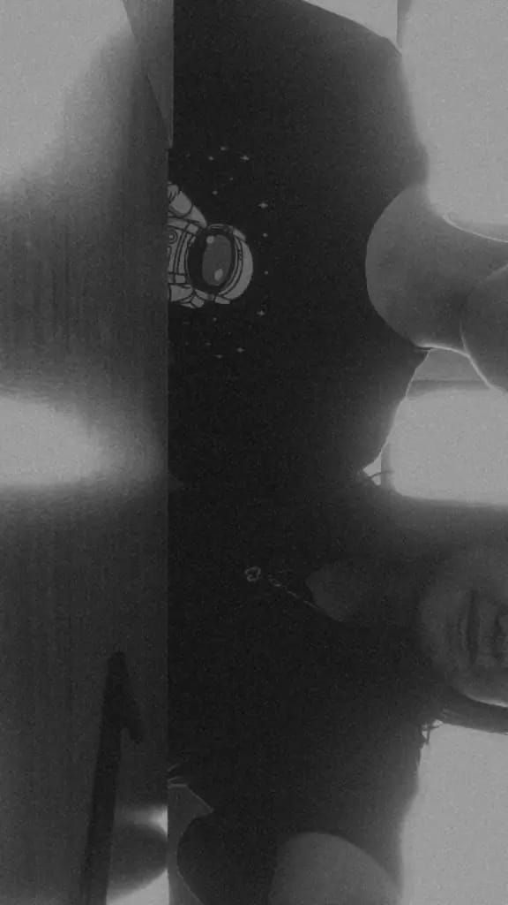

<!DOCTYPE html>
<html lang="id">
<head>
  <meta charset="UTF-8">
  <meta name="viewport" content="width=device-width, initial-scale=1.0">
  <title>Anniversary 1 Tahun Jadian</title>
  
</head>
<body>

  <!-- Audio baru dengan link dari Google Drive -->
  <audio src="Lagu.mp3" id="linkmp3" class="sembunyi" loop></audio>

  <!-- POP-UP 1 -->
  

    <h2>Jalann jalann kee kotaa Pemalangg</h2>
    
Happy anniversary sayangg 💖

    <button onclick="nextPopup(1)">Lanjut</button>
  

  <!-- POP-UP 2 -->
  

    <h2>Ikann nilaa ikann laut</h2>
    
Sudaa ayoo kitaa lanjutt 💕

    <button onclick="nextPopup(2)">Lanjut</button>
  

  <!-- POP-UP 3 -->
  

    <h2>Uburr uburr ikann lelee</h2>
    
Udahh satuu tahunn leeee 🎉

    <button onclick="nextPopup(3)">Lanjut</button>
  

  <!-- POP-UP 4 -->
  

    <h2>Halo Seng!!</h2>
    
Penasarann kann apaa isinyaa??

    <button onclick="nextPopup(4)">Lanjut</button>
  

  <!-- POP-UP 5 -->
  

    <h2>Penasaran kaannn!</h2>
    <button onclick="startClickPopups()">Klik dongg!!</button>
  

  <!-- POP-UP UNTUK KLIK ULANG (harus diklik 7 kali secara manual) -->
  

    <h2>KLIKK DISINII</h2>
    <button onclick="handleClick()">KLIK</button>
  

  <!-- POP-UP TERAKHIR -->
  

    <h2>HAHAHAHA capee yaaaaaa klikk teruss eheheheh yasudaa yangg kalii inii seriuss</h2>
    <button onclick="showMainPage()">DISINII 💗</button>
  

  <!-- HALAMAN UTAMA -->
  

    <h1>Happy 1st Anniversary! 💖</h1>
    

      Terima kasih sayangg sudah bersamakuu selama satu tahun! Aku bersyukur bisa menjalani setiap hari bersamamu.  
      Kamu adalah cahaya dalam hidupku, dan aku ingin terus bersamamu selamanya. Kita telah melewati suka dan duka bersama.  
      Setiap tawa, tangisan, dan momen yang kita jalani semakin menguatkan cinta kita. Aku mencintaimu lebih dari kata-kata yang bisa menggambarkan.  
      Setiap detik bersamamu adalah anugerah. Hari ini adalah bukti bahwa cinta kita kuat dan akan terus tumbuh.
    

    <h2>Galeri Foto Kita</h2>
    

      
      
1. Chat kalo kita resmi jadian. 

      
      
2. Pertama kali kita foto bareng cieeee. 

      
      
3. Kita foto di bo waktu itu pake love" lagii hahahah. 

      
      
4. Nahh ini foto tangan kita yang mungil hahahah. 

      
      
5. Kita fotbar lagi tapi dikaca tetangga warung sama hujan"ann hahahaha. 

      
      
6. Inii pass latihan upacara kita satu jadwal buat tugas ehehhe. 

      
      
7. Nahh itu foto kita terahkir di kelas 11 sebelum kita liburan 💗. 

    

    

      <iframe width="560" height="315" 
              src="" 
              frameborder="0" 
              allow="autoplay; encrypted-media" 
              allowfullscreen>
      </iframe>
    

  

  

</body>
</html>
